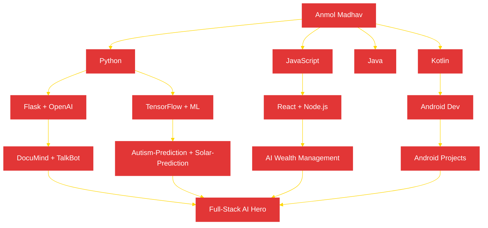

<div align="center">

<!-- Animated Spider Web Header -->


<!-- Animated Typing Effect -->
<a href="https://git.io/typing-svg">
  
</a>

<!-- Spiderman Themed Badges -->
<a href="https://github.com/Anmol954?tab=repositories">
  
</a>

<a href="https://www.google.com/maps/place/Jalandhar,+Punjab,+India">
  
</a>


<br><br>

<!-- Animated Spiderman GIF -->


<!-- Spiderman Logo SVG -->
<picture>
  <source media="(prefers-color-scheme: dark)" srcset="https://raw.githubusercontent.com/Arsho/spiderman-github-readme-stats/main/assets/spiderman-logo.svg" />
  <source media="(prefers-color-scheme: light)" srcset="https://raw.githubusercontent.com/Arsho/spiderman-github-readme-stats/main/assets/spiderman-logo.svg" />
  
</picture>

<br><br>

<!-- Snake Animation Card -->
<a href="https://github.com/Anmol954">
  
</a>

</div>

---

## 🕸️ About Me

<div align="center">

```text
 "With great power comes great responsibility."
```

> I'm **Anmol Madhav** — a skilled programmer from Jalandhar, Punjab, India 🇮🇳
> swinging through the concrete jungle of Python, JavaScript, and Kotlin.
> I tangle bugs in my web, scale walls of AI architectures,
> and always keep my spidey-sense tingling for the next big challenge.

</div>

<div style="display: flex; justify-content: space-between; width: 100%;">
  

- 🔴 **Currently:** Building AI-powered applications & intelligent systems
- 🕸️ **Learning:** Advanced LLM Integration, Cloud Architecture, Next-Gen Android Dev
- 🏙️ **Location:** Jalandhar, Punjab, India
- 💥 **Superpower:** Turning ideas into production-ready Python & JS code
- 🎯 **Mission:** Merging AI, Web, and Mobile to build the future — one commit at a time
- 📱 **Android Dev:** Crafting beautiful experiences with Kotlin

</div>

---

## 📡 Spidey-Sense Status

<div align="center">

<!-- Activity & Status Badges -->
<a href="https://github.com/Anmol954?tab=repositories">
  
</a>

<br>

<!-- Streak Stats -->
<a href="https://github.com/DenverCoder1/github-readme-streak-stats">
  
</a>

<br>

<!-- Top Languages -->
<a href="https://github.com/anuraghazra/github-readme-stats">
  
</a>

<br>

<!-- GitHub Activity Graph -->
<a href="https://github.com/ashutosh00710/github-readme-activity-graph">
  
</a>

</div>

### 🎯 Current Missions

| Status | Mission | Progress |
|--------|---------|----------|
| 🟢 Active | Building AI & ML Projects (DocuMind, TalkBot, Autism-Prediction) | ████████░░ 80% |
| 🟡 In Progress | Learning Advanced LLM Integration & LangChain | ██████░░░░ 60% |
| 🔴 On Alert | Open Source Contributions & Community Projects | ████░░░░░░ 40% |
| 🕸️ Webbed | Exploring Cloud Architecture Patterns | █████░░░░░ 50% |
| ⚡ Charged | Android Development with Kotlin | ███████░░░ 70% |
| 📱 Building | ENDEE & ServiceHive Projects | ██████░░░░ 60% |

---

## 🛠️ Gadgets & Gear

<div align="center">

### 🎭 Web-Shooters (Languages)


### 🦾 Utility Belt (Frameworks & Libraries)


### 🔧 Tech Lab (Tools & Platforms)


</div>

<details>
<summary><strong>🕷️ Expand to see my full Spidey Arsenal</strong></summary>

```javascript
const anmol = {
  name: "Anmol Madhav",
  alias: "Spider-Dev",
  location: "Jalandhar, Punjab, India",
  code: ["Python", "JavaScript", "TypeScript", "Java", "Kotlin"],
  webFrameworks: {
    frontend: ["React", "HTML5", "CSS3", "Tailwind CSS", "Bootstrap"],
    backend: ["Flask", "Node.js", "Express"],
    mobile: ["Android", "Kotlin"]
  },
  ai_ml: {
    frameworks: ["TensorFlow", "LangChain", "OpenAI API"],
    tools: ["FAISS", "Streamlit", "Jupyter Notebook"]
  },
  gadgets: {
    databases: ["MySQL", "MongoDB", "Firebase"],
    cloud: ["Docker", "Firebase"],
    tools: ["Git", "GitHub", "VS Code", "Android Studio", "Postman", "Figma"],
    apis: ["REST API", "GraphQL"]
  },
  superPowers: [
    "AI/ML Engineering", "Full-Stack Development", "Android Development",
    "Data Analysis (SQL, Excel, Tableau, Power BI)", "RAG Systems",
    "Computer Vision", "Voice-Enabled Applications", "Agile Methodology"
  ],
  currentMission: "Building AI-powered intelligent systems 🕷️"
};
```

</details>

---

## 🌐 My Network

<div align="center">

### 🤝 Allies & Collaborators

<!-- GitHub Followers & Following -->
<a href="https://github.com/Anmol954?tab=followers">
  
</a>
<a href="https://github.com/Anmol954?tab=following">
  
</a>
<a href="https://github.com/Anmol954?tab=repositories">
  
</a>

<br><br>

<!-- Connect With Me Badges -->
<a href="https://linkedin.com/in/yourlinkedin">
  
</a>
<a href="mailto:youremail@gmail.com">
  
</a>
<a href="https://github.com/Anmol954">
  
</a>

</div>

### 🏆 Open Source Contributions

<div align="center">

<!-- Trophy -->
<a href="https://github.com/ryo-ma/github-profile-trophy">
  
</a>

</div>

### 🎮 Team-Up Requests (Open to Collaboration)

| Project | Role | Tech Stack | Status |
|---------|------|------------|--------|
| DocuMind | AI Engineer | Python + FAISS + OpenAI + Flask | 🟢 Completed |
| TalkBot | Full Stack | Python + OpenAI + SpeechRecognition + Flask | 🟢 Completed |
| AI Wealth Management | Frontend Dev | JavaScript | 🕸️ In Progress |
| ServiceHive Assignment | Backend Dev | Python | 🟡 In Progress |
| Customer Retention Analysis | Data Analyst | SQL + Excel + Tableau | 🟢 Completed |
| Crypto Market Dashboard | Data Viz | Power BI + Crypto APIs | 🟢 Completed |

---

## 🎬 Spidey's Lab (Featured Projects)

<div align="center">

<!-- Pinned Repo Cards -->

<a href="https://github.com/Anmol954/DocuMind">
  
</a>
<a href="https://github.com/Anmol954/Mini-JARVIS">
  
</a>

<a href="https://github.com/Anmol954/TalkBot">
  
</a>
<a href="https://github.com/Anmol954/AI_Wealth_Management">
  
</a>

<a href="https://github.com/Anmol954/Crypto-Market-Trends-Dashboard">
  
</a>
<a href="https://github.com/Anmol954/Customer-Retention-and-Churn-Analysis">
  
</a>

</div>

---

## 🧠 AI/ML Arsenal (Spider-Bots)

<div align="center">

> *"My Spider-Sense tingles every time a new AI model drops."*

| Project | Type | Tech | Description |
|---------|------|------|-------------|
| 🤖 **DocuMind** | RAG System | FAISS + OpenAI + Flask | Query PDFs in natural language with context-aware answers |
| 🎙️ **TalkBot** | Voice Chatbot | SpeechRecognition + GPT + Flask | Voice-enabled AI assistant with STT and TTS |
| 🧠 **Autism-Prediction** | ML Model | Python + Jupyter | ML-based autism spectrum disorder prediction system |
| 🌞 **Solar-Irradiance** | ML Prediction | Python + Jupyter | Predicting solar irradiance using machine learning |
| 🛒 **Product-Recommendation** | ML Engine | Python | Smart product recommendation system |
| 🏪 **Store-Intelligence** | Computer Vision | Python | CV system for retail store intelligence from production to API |
| 📊 **Electric-Vehicle Analysis** | Data Analysis | Jupyter Notebook | EV market data analysis and insights |

</div>

---

## 📱 Android & Web Projects

<div align="center">

| Project | Platform | Tech | Description |
|---------|----------|------|-------------|
| 📱 **Android-Projects** | Android | Kotlin | Native Android application development |
| 🌐 **Multi-Language App** | Android | Kotlin | Multi-language support Android application |
| 🎲 **Snakes & Ladders** | Web | HTML/CSS/JS | Classic board game web implementation |
| 💰 **Basic Bill Generator** | Desktop | Java | Bill generation system in Java |
| 🎮 **Quiz Game** | Desktop | Python | Interactive quiz game built with Python |

</div>

---

## 🕸️ Web of Knowledge (Learning Path)



---

## 📊 Spidey Metrics Dashboard

<div align="center">

<!-- GitHub Profile Summary Cards -->
<a href="https://github.com/vn7n24fzkq/github-profile-summary-cards">
  
</a>

<br>


</div>

---

## 🦸 Quotes from the Spider-Verse

<div align="center">

> *"Anyone can wear the mask. You could wear the mask."*
> — Spider-Man: Into the Spider-Verse

> *"With great power comes great responsibility."*
> — Uncle Ben Parker

> *"I'm skilled Programmer in Python, CSS and JavaScript — and I'm just getting started."*
> — Anmol Madhav

</div>

---

<div align="center">

<!-- Footer with animated web -->


<!-- Profile Views Counter -->


<br><br>

<!-- GitHub Stats Badge -->


</div>

---

<details>
<summary><strong>🕷️ The Secret Web (Hidden Config)</strong></summary>

```json
{
  "name": "Anmol Madhav",
  "username": "Anmol954",
  "alias": "Spider-Dev",
  "location": "Jalandhar, Punjab, India",
  "occupation": "Full-Stack Developer | AI/ML Enthusiast | Android Developer",
  "education": "B.Tech, Computer Science",
  "motto": "With great power comes great responsibility",
  "skills": {
    "primary": ["Python", "JavaScript", "Kotlin"],
    "secondary": ["TypeScript", "Java", "HTML5", "CSS3"],
    "ai_ml": ["TensorFlow", "OpenAI", "LangChain", "FAISS"],
    "mobile": ["Android", "Kotlin"],
    "backend": ["Flask", "Node.js", "Express"],
    "frontend": ["React", "Tailwind CSS", "Bootstrap"],
    "databases": ["MySQL", "MongoDB", "Firebase"],
    "tools": ["Git", "Docker", "VS Code", "Android Studio", "Postman"],
    "data_viz": ["Power BI", "Tableau", "Excel"]
  },
  "workspace": {
    "editor": "VS Code",
    "os": "Windows",
    "browser": "Chrome"
  },
  "currently_learning": [
    "Advanced LLM Integration",
    "Next-Gen Android Development",
    "Cloud Architecture Patterns"
  ]
}
```

</details>

---

<!-- Spinning Web Easter Egg -->
<div align="center">

</div>
